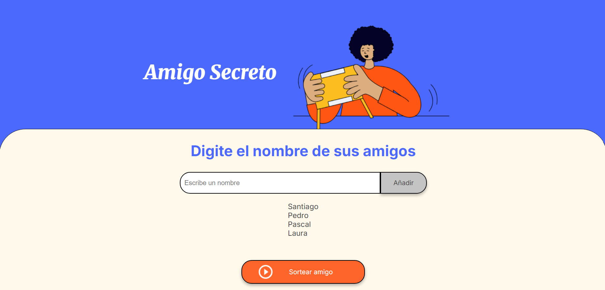
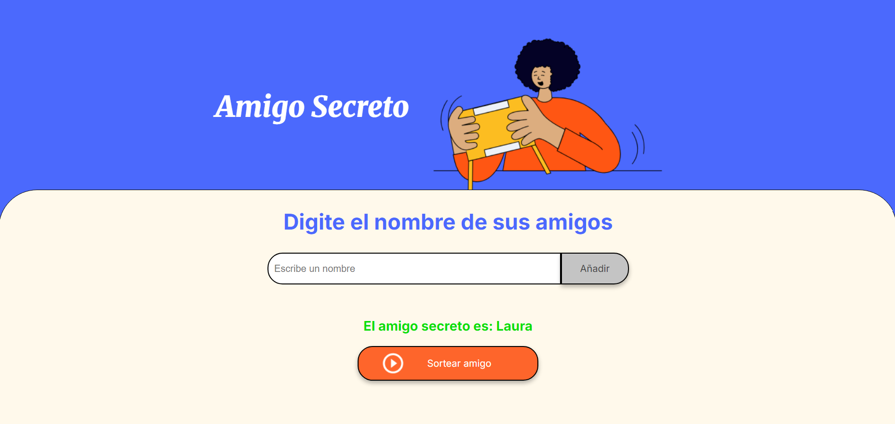

<h1 align="center"> Challenge Amigo Secreto - Alura Latam </h1>

<h2>En este challenge realicé la programación del código de una página cuya función es insertar nombres y sortearlos para jugar al amigo secreto</h2>

<h3> Funcionalidades: </h3>
<h3> 1. Insertar nombres y agregar a la lista: </h3>

 En la barra de texto podrán insertarse los nombres de tus amigos, usando el botón "Añadir" podrás agregarlos a la lista que se desplegará en la parte baja de la barra de texto.</Añadir>
 

<h3>2. Sortear amigos:</h3>

 Cuando tu lista de amigos esté terminada, podrás darle al botón "Sortear amigo" para que la página seleccione aletoriamente a alguien de la lista.

